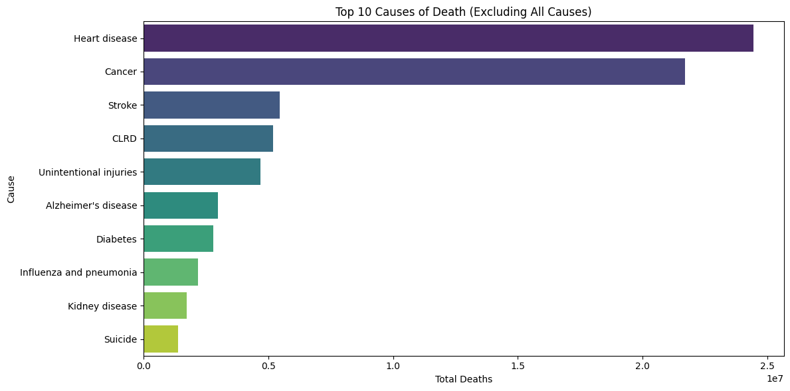
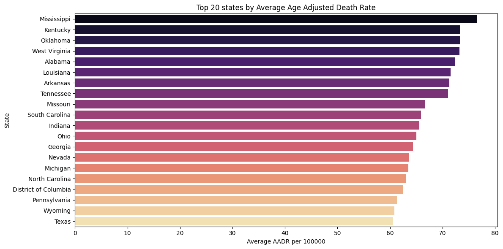
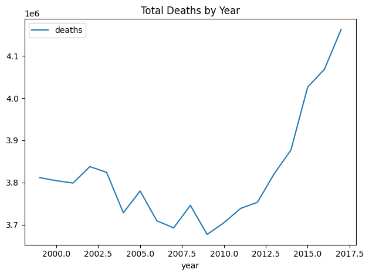

# Visualizing America’s Leading Causes of Death: A CDC Data Exploration

## Overview
This project analyzes publicly available CDC mortality data to uncover trends in causes of death across U.S. states and years. Using the CDC’s open API, I extracted and cleaned more than 10,000 records from the dataset `bi63-dtpu`. From there, I used Python’s **pandas**, **matplotlib**, and **seaborn** libraries to visualize national and state-level mortality patterns.  

Plots were created using a combination of Seaborn and Matplotlib to balance style and customization. One of the key metrics explored is the **AADR (Age-Adjusted Death Rate)**. This standardized rate accounts for differences in age distribution across populations: it sums the age-specific death rates for each age group and multiplies each by the proportion of a standard population in the same age group. This allows for fair comparisons between states and over time.  

The data covers death and disease rates from **1999 to 2017**, including both overall death counts and rates by specific causes. Mortality trends are a critical public health measure—they inform policy decisions, resource allocation, and highlight areas where healthcare disparities may exist.  

---

## Method

**Data Source**  
All data were pulled from the CDC’s public API endpoint:  
[CDC Mortality Data](https://data.cdc.gov/resource/bi63-dtpu.json)  
This endpoint provides open, public domain data on deaths in the United States by cause, state, and year.  

**Data Collection and Cleaning**  
- Used Python’s `requests` library to query the API and retrieve JSON-formatted data.  
- Converted the JSON into a **Pandas DataFrame** for analysis.  
- Numeric fields (`deaths`, `aadr`, `year`) were converted from strings to numeric types for plotting and aggregation.  
- Removed null or missing values, and filtered out the “All causes” category to focus on specific causes of death.  

**Analysis Goals**  
1. Identify the *Top 10 causes of death* nationwide.  
2. Examine *changes in total deaths by year*.  
3. Compare *state-level Age-Adjusted Death Rates (AADR)* to highlight regional differences.  

**Ethical Considerations**  
All data used in this project are publicly available through the CDC’s open data initiative. No private or identifiable information was accessed or used. The analysis follows good data practice by respecting API usage guidelines and ensuring proper citation of the source.

---

## Key Findings

- The **top causes of death** consistently include **heart disease**, **cancer**, and **stroke**. Heart disease remains the leading cause in most years, followed closely by various types of cancer.  
- National death counts show an overall increase from 2008 to 2017, with a slight decline between 2000 and 2008. These trends reflect demographic shifts and health crises over time, such as the opioid epidemic and aging population.  
- **State-level AADR analysis** reveals geographic disparities in mortality rates. Southern states such as Mississippi, Alabama, and Louisiana have higher average AADR values, indicating health inequalities that may be linked to socioeconomic factors, access to healthcare, or chronic disease prevalence.  
- Comparing trends by cause shows that some diseases, like diabetes and chronic lower respiratory disease, exhibit slow but steady increases, while others, like influenza and pneumonia, fluctuate more year-to-year.  

---

## Visualizations

### Top 10 Causes of Death
  
This bar chart summarizes total deaths nationwide by cause. It highlights the persistent dominance of heart disease and cancer as leading causes. The chart allows for a quick comparison of relative mortality impact among causes.  

### State Age-Adjusted Death Rate (AADR)
  
This plot displays the average AADR by state. Southern states generally have higher rates, emphasizing regional health disparities. States with lower AADR, such as Hawaii and California, appear near the bottom, reflecting differences in public health interventions and population characteristics.  

### Deaths Over Time
  
This line chart shows trends in national death counts from 2000 to 2017. It highlights periods of rising and falling mortality, providing context for policy changes and public health responses during those years.

## Future Work
- Integrate additional CDC or NIH datasets to explore correlations between mortality and risk factors (e.g., obesity, smoking, socioeconomic status).  
- Perform regression analysis to model causes of death relative to demographic and regional predictors.  
- Develop an interactive dashboard using **Streamlit** or **Dash** to allow users to explore state-level trends dynamically.  
- Given the highest levels of obesity, heart failure and stroke, conduct further research into ways to both combat those causes of death and teach others to combat these diseases as well. 

---

## Links
- [Full Repository on GitHub]("https://github.com/mcooperjay/mcooperj.data_aquisition_code.io)  
- [main.py Code File](https://github.com/mcooperjay/mcooperj.data_aquisition_code.io/blob/main/main.py)  
- [View on GitHub Pages]("https://mcooperjay.github.io/mcooperj.data_aquisition_code.io/")

---

This blog post provides a concise but comprehensive summary of the dataset, methods, and key findings, while highlighting the visualizations created and making the repository and code accessible to readers interested in replicating or extending the analysis.
